# Catinder
Hi, there!

This is simple app was made by me as a test task for an intership at MacPaw. 

App uses the [TheCatAPI](https://thecatapi.com/) for loading cat breeds information and random cat images from API base.
Application have tab bar with 4 views:  
1. Bestiary
2. Rate
3. Favourites
4. User

## 1. Bestiary
On this screen we have list of all breeds which loaded from API. Taping on the cell with breed name opens the next screen which displays a short description of breed and uploads a photo.

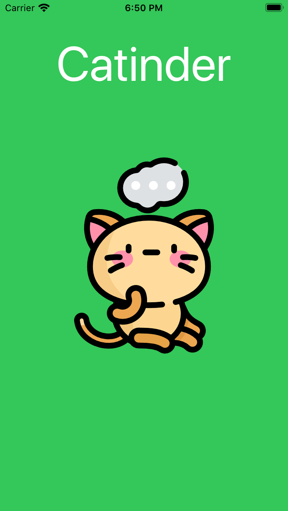 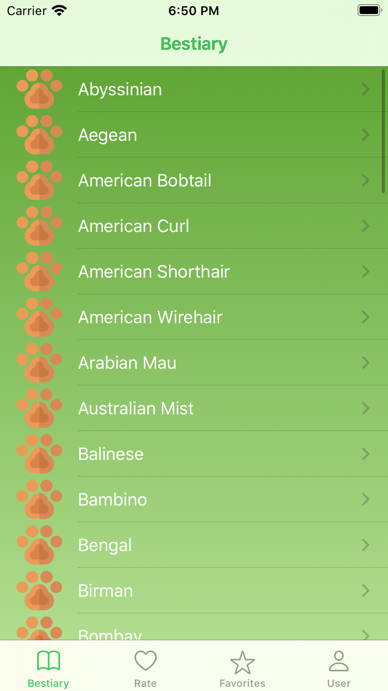 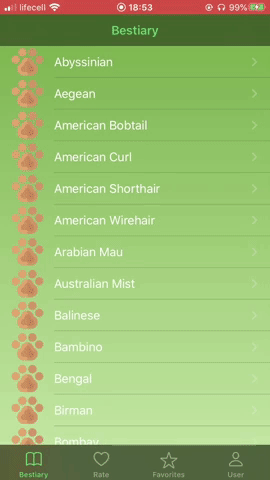

## 2. Rate
Here we get images og cats and user can rate this images by swiping right to like image and left to dislike. Liked images sending to another tab named Favourites.

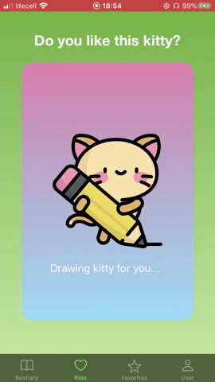 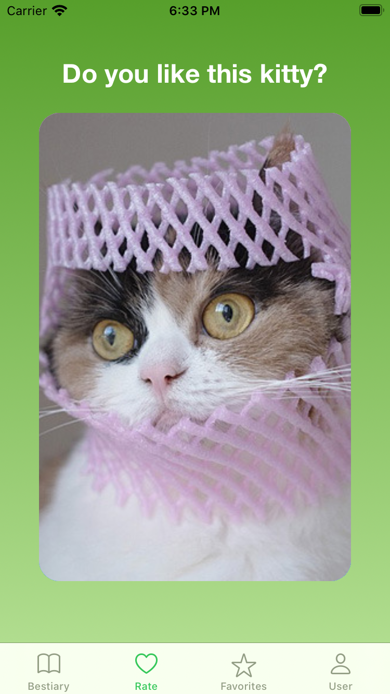 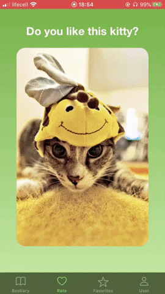

## 3. Favourites
Images liked by the user are displayed here. User can tap on the image to enlarge it.

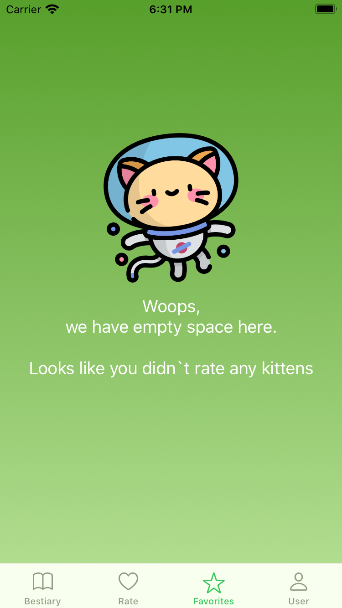 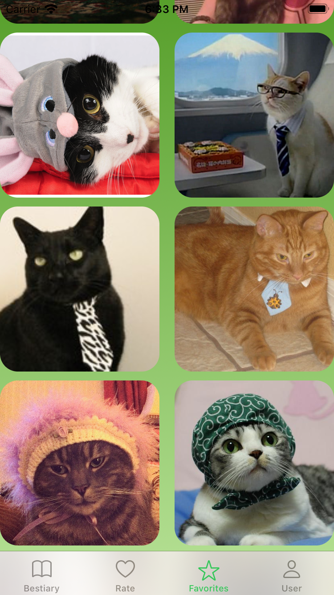 

## 4. User
Here we have user settings. User can write his name and choose his sex, after cliking on save button this data is saving on his device. As an additional feature user can customize search to see only one category of images.

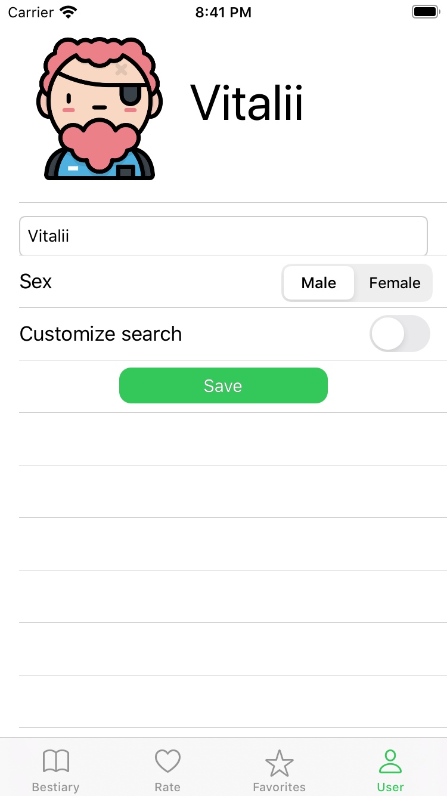 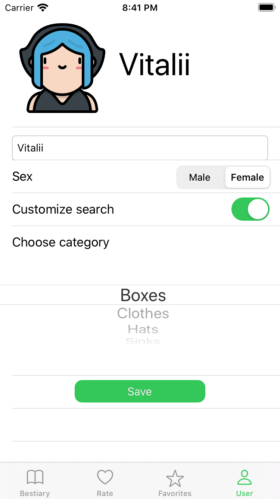 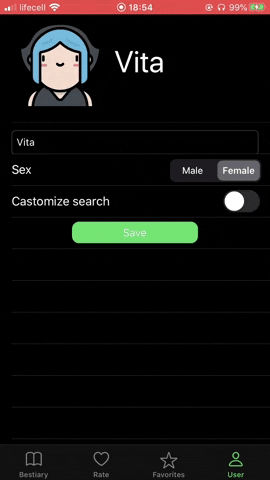

>Icons made by Freepik from www.flaticon.com
>
>[Kawaii Avatars Icon Pack](https://www.flaticon.com/packs/kawaii-avatars-3)
>
>[Kitty Avatars Icon Pack](https://www.flaticon.com/packs/kitty-avatars-3)

